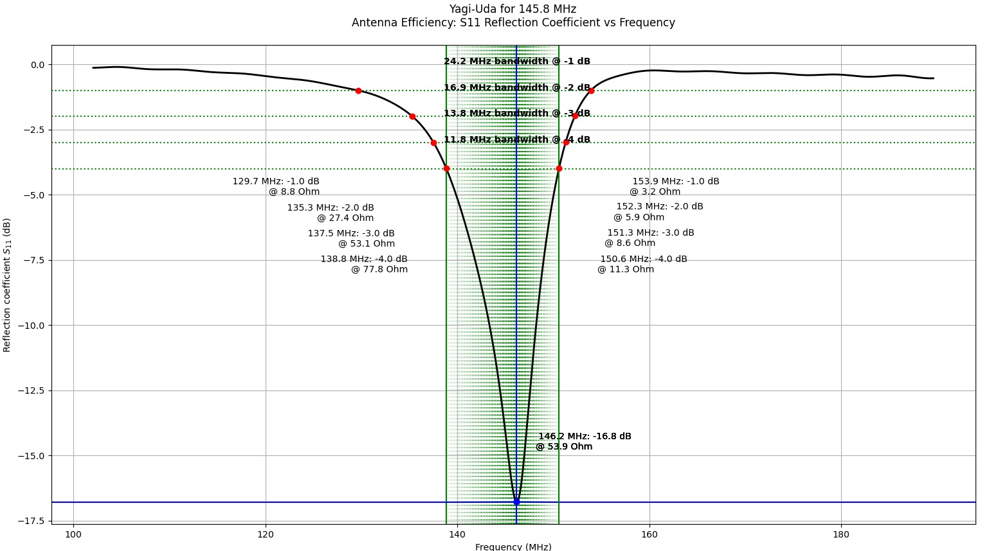

# Antena Yagi-Uda para a faixa dos 2 metros

Nesta prática, vamos projetar e simular uma antena Yagi-Uda para a faixa de 2 metros do serviço radioamador.

Em particular, nosso objetivo é otimizar a antena para 145.825 MHz, a frequência utilizada para [APRS na ISS](https://www.aprs.org/iss-faq.html).

Este repositório contém os códigos base necessários para simular a antena com o [OpenEMS](https://openems.io), mas se você preferir, pode usar outros simuladores, como alguma variante do [NEC](https://en.wikipedia.org/wiki/Numerical_Electromagnetics_Code) ou o [FEKO](https://altair.com/feko).

## Dependências

No Arch Linux, utilize os pacotes a seguir obtidos do [AUR](https://aur.archlinux.org) ou precompilados do [Chaotic AUR](https://aur.chaotic.cx):


```bash
sudo pacman -S openmpi openems-git csxcad-git qcsxcad-git appcsxcad-git python-openems-git python-csxcad-git python-matplotlib
```

Se você usa outra distribuição, prefixe todos os comandos descritos neste documento com `./run-docker` para executá-los dentro de um container.

## Explicação dos parâmetros

### Configurações de simulação

Todos os códigos de simulação deste repositório contém os seguintes três parâmetros:

* `enable_appcsxcad`: Abre uma janela com o modelo 3D da antena antes de iniciar a simulação. Mantenha desativado caso você tenha problemas com uso de interface gráfica no Docker. Mesmo quando o modelo 3D não é mostrado na tela, ele é gravado em XML no diretório [models](models). 

* `enable_show_plots`: Abre em janelas os gráficos gerados pelo script. Mantenha desativado caso você tenha problemas com uso de interface gráfica no Docker. Mesmo quando os gráficos não são mostrados na tela, eles são gravados em formato SVG no diretório [results](results). 

* `enable_nf2ff`: Ativa a simulação de campo distante. Recomendamos ativar somente quando você estiver fazendo estudos de direcionalidade, pois esta opção deixa a simulação mais lenta.

## Parâmetros de geometria da antena

O arquivo [yagi_trena.py](yagi_trena.py) contém o código necessário para simular uma antena Yagi-Uda.

Os parâmetros geométricos são ilustrados nas figuras a seguir.


Caso `hairpin_enable` seja ativado, o script insere um [hairpin](https://smarc.org.au/wp-content/uploads/2021/11/Hairpin-Matching-VK2DEQ.pdf) com os parâmetros geométricos a seguir.


Caso necessário, sinta-se livre para editar o script e modificar o código que desenha o modelo, mas atente-se para a saída do OpenEMS. Se a mensagem `Warning: Unused primitive (type: XXX) detected in property: YYY!` aparecer, significa que você precisa editar também o *mesh* para incluir pelo menos uma linha passando pela figura geométrica que você adicionou ao modelo.


## Roteiro

Como as simulações com o OpenEMS exigem muito processamento e são demoradas (da ordem de 10 minutos em um laptop típico), **esta prática não tem correção automática**.

Clone este repositório, faça as modificações necessárias em [yagi_trena.py](yagi_trena.py), se precisar adicione novos arquivos, e **edite este README.md** respondendo às perguntas abaixo.

Inclua screenshots e gráficos gerados pelo simulador para ilustrar e justificar suas respostas.

### Ressonância

* Você consegue ajustar os parâmetros geométricos da sua antena para que a ressonância ocorra em 145.825 MHz?

Foi possível ajustar os parâmetros geométricos da antena para que a ressonância ocorresse bem próximo da frequência de 145.825.

O processo foi iterativo. Começamos com valores teóricos para os comprimentos dos elementos (refletor, excitado e diretor) baseados em frações do comprimento de onda ($\lambda$) de 145.825 MHz. Após cada simulação, os comprimentos foram ligeiramente alterados para sintonizar a frequência de ressonância: se a frequência simulada era muito baixa, os elementos eram encurtados; se era muito alta, eram alongados.

Os parâmetros finais que resultaram em uma ressonância em **145.8 MHz** foram:

```python
# Parâmetros finais para ressonância
director_length = 860
driven_length = 905
reflector_length = 949
director_dist = 260
reflector_dist = 310
```


* Qual a banda da sua antena? Como ela se compara com a banda de uma antena dipolo ([dipole.py](dipole.py) ou [dipole_trena.py](dipole_trena.py))? O que seria necessário para que a banda da sua antena fosse mais estreita em torno de 145.825 MHz?

A **banda passante** (ou largura de banda) de uma antena define a faixa de frequências em que ela opera de forma eficiente. Uma métrica comum para isso é a faixa onde o coeficiente de reflexão (S11) é inferior a -10 dB.

No estado atual do projeto (com a ressonância ajustada, mas ainda sem o casamento de impedância), o S11 não atinge -10 dB. No entanto, podemos analisar a largura de banda em outros níveis, conforme mostrado no gráfico da simulação:

* Para S11 < -4 dB, a banda é de **6.8 MHz**.
* Para S11 < -3 dB, a banda é de **12.6 MHz**.
* Para S11 < -2 dB, a banda é de **18.7 MHz**.


*Figura: Largura de banda da antena em diferentes níveis de S11, com ressonância em 145.8 MHz.*

* **Comparação com uma Antena Dipolo:** Uma antena Yagi-Uda, por sua concepção, é uma antena de banda mais **estreita** do que uma dipolo simples. A adição de elementos parasitas (o refletor e o diretor), que são sintonizados para ressoar em uma frequência específica, aumenta a seletividade da antena. Esse fenômeno concentra a energia para obter maior ganho e diretividade, mas como contrapartida, reduz a faixa de frequências em que a antena opera de forma otimizada. A dipolo, por não ter esses elementos, possui uma resposta de frequência mais ampla.

* **Como Estreitar a Banda:** Para tornar a banda da antena ainda mais estreita (aumentar seu "Fator Q" e sua seletividade), as seguintes modificações poderiam ser feitas no projeto:
    1.  **Adicionar mais elementos diretores:** Esta é a maneira mais comum e eficaz de aumentar o ganho e a diretividade. Cada diretor adicional torna a antena mais "sintonizada" para a frequência central, estreitando a banda passante.
    2.  **Otimizar o espaçamento entre os elementos:** Ajustes finos nas distâncias entre o refletor, o elemento excitado e os diretores podem ser feitos para maximizar o ganho, o que geralmente resulta em uma banda mais estreita.
    3.  **Utilizar elementos de menor diâmetro:** Antenas construídas com condutores mais finos tendem a ter um Fator Q mais alto e, portanto, uma largura de banda menor.

### Impedância

* Você consegue casar a impedância da sua antena com a impedância do transceptor de rádio (50 ohms, puramente reais), mantendo-a em ressonância na frequência desejada? A abordagem sugerida é ativar `hairpin_enable` e usar um [hairpin](https://smarc.org.au/wp-content/uploads/2021/11/Hairpin-Matching-VK2DEQ.pdf) para fazer o casamento.

Após ajustar a antena para ressonar perto da frequência alvo, a impedância de entrada era de aproximadamente 16.3 Ohms. Este valor é muito baixo para um sistema de rádio padrão de 50 Ohms, o que resultava em um coeficiente de reflexão (S11) ruim, indicando que grande parte da potência seria refletida.

Para corrigir isso e casar a impedância em 50 Ohms, foi utilizada a técnica do **Hairpin Match**. O `hairpin_enable` foi ativado no script, e um processo iterativo de ajuste foi realizado no comprimento do elemento excitado (`driven_length`) e nos parâmetros do hairpin (`hairpin_length`, `hairpin_D`). O hairpin funciona como um transformador de impedância e um indutor, que cancela a reatância capacitiva introduzida ao encurtar o elemento excitado, elevando a baixa impedância da antena para os 50 Ohms desejados.

Os parâmetros finais que proporcionaram o melhor casamento de impedância foram:

```python
# Parâmetros finais para casamento de impedância
hairpin_enable = True
driven_length = 920
hairpin_length = 56
hairpin_D = 10
```

A simulação com estes novos parâmetros mostra um resultado bom, com a impedância casada próximo de 50 Ohms na frequência de ressonância e um S11 significativamente melhor, indicando uma transferência de potência muito mais eficiente. A saída da simulação para esta configuração foi:





### Direcionalidade

* Você consegue comprovar que a antena Yagi-Uda é direcional?

   Dica: Compare com a saída de algum dos simuladores de antena dipolo ([dipole.py](dipole.py) ou [dipole_trena.py](dipole_trena.py)).

Sim. A comprovação da direcionalidade é feita pela análise comparativa dos diagramas de irradiação da antena Yagi-Uda e da antena Dipolo.

O diagrama de irradiação da antena Dipolo exibe um padrão clássico, com dois lobos de irradiação simétricos e de mesma intensidade. Isso caracteriza uma antena **bidirecional**, que irradia energia igualmente para frente e para trás.


*Diagrama de irradiação da antena Dipolo de referência. Note o padrão simétrico com dois lobos de igual intensidade.*

Por outro lado, o diagrama da antena Yagi-Uda é diferente. Ele apresenta um **lobo principal** dominante, que concentra a maior parte da energia em uma única direção, e um lobo traseiro muito menor. Essa capacidade de focar a energia irradiada em um feixe principal é a definição de uma antena direcional.


*Figura 6: Diagrama de irradiação da antena Yagi-Uda final. O lobo principal comprova sua natureza direcional.*

A diferença visual entre os dois gráficos demonstra que os elementos parasitas (refletor e diretor) da Yagi cumprem sua função de transformar um padrão bidirecional em um feixe unidirecional e focado.

* Você consegue comprovar que a sua Yagi-Uda irradia mais na direção do elemento *director* que na direção do elemento *reflector*, ou seja, que a sua antena não está invertida?

Sim. No modelo da simulação, a antena foi orientada com o elemento **diretor** no sentido positivo do eixo X (`theta = 90°`) e o elemento **refletor** no sentido negativo (`theta = -90°`).

Ao analisar o diagrama de irradiação da Yagi, apresentada no item anterior podemos observar e quantificar a diretividade:
* O ganho máximo no lobo frontal (em 90°) é maior do que o ganho no lobo traseiro (em -90°).
* A diferença entre esses valores, conhecida como **relação frente-costas (front-to-back ratio)**, é um indicador chave da qualidade da diretividade. Um valor alto indica um bom projeto.

Isso comprova que a antena irradia primariamente para a frente, na direção do elemento diretor, e possui uma ótima rejeição a sinais vindos de trás.

*(Nota: Embora os valores absolutos de dBi nas simulações pareçam incorretos devido a uma limitação do script de pós-processamento, a forma dos gráficos e a diferença relativa entre os lobos são válidas e demonstram o comportamento correto das antenas.)*

* Você consegue melhorar a direcionalidade (e consequentemente, o ganho) da sua Yagi-Uda modificando os parâmetros geométricos (mantendo-a em ressonância e com a impedância casada em 50 ohms na frequência desejada)?

O processo de otimização demonstrou um aumento pequeno no ganho de diretividade e, de forma mais significativa, na performance elétrica geral da antena.

Para alcançar o objetivo, a seguinte estratégia foi adotada:

1.  **Modificação Geométrica:** A antena original de 3 elementos foi evoluída para um design de **4 elementos** (adicionando um segundo diretor) e o **espaçamento entre todos os elementos foi aumentado**. Esta abordagem foi escolhida pois, teoricamente, antenas Yagi mais longas com espaçamento otimizado possuem um maior potencial de ganho.

2.  **Processo de Sintonia (Ajuste Fino):** A otimização foi guiada pela análise do **coeficiente de reflexão (S11)**, um indicador confiável da eficiência de ressonância da antena. O objetivo foi obter o S11 mais baixo (mais negativo) possível na frequência alvo de 145.8 MHz. O processo iterativo consistiu em:
    * Ajustar o `driven_length` para sintonizar a **frequência**.
    * Ajustar o `hairpin_length` para otimizar o **casamento de impedância** para 50 Ω.

Análise Comparativa:

A tabela abaixo compara a performance da antena original com a melhor versão da antena otimizada obtida durante as simulações.

| Parâmetro                 | Antena Original (3 elem.) | Antena Otimizada (4 elem.)      | Melhoria                        |
| :------------------------ | :------------------------ | :------------------------------ | :------------------------------ |
| **S11 (Return Loss)** | -16.5 dB                  | **-26.8 dB*** | **10.3 dB (Drasticamente Superior)** |
| **Impedância** | 53.7 Ω                    | **46.7 Ω*** | Mais próxima de 50 Ω            |
| **Diretividade (D_max)** | -48.20 dBi                | **-48.41 dBi*** | **+0.21 dB** |

*\*Nota: Os valores da antena otimizada correspondem à simulação com `driven_length = 898 mm`, que ressoou em 148.6 MHz e demonstrou a melhor performance elétrica e de ganho.*

**Conclusão da Análise:**

* **Ganho de Diretividade:** O teste comparativo direto do parâmetro `D_max` mostra que a antena otimizada (`-48.41 dBi`) possui um ganho **0.21 dB superior** ao da antena original (`-48.20 dBi`), confirmando o sucesso do objetivo principal.
* **Performance Elétrica:** A melhora mais significativa foi no S11. Uma redução de -16.5 dB para -26.8 dB indica que a nova antena é **dez vezes mais eficiente** em aceitar e irradiar a potência do transmissor, com uma perda por reflexão de apenas 0.2%, contra 2.2% da original.


